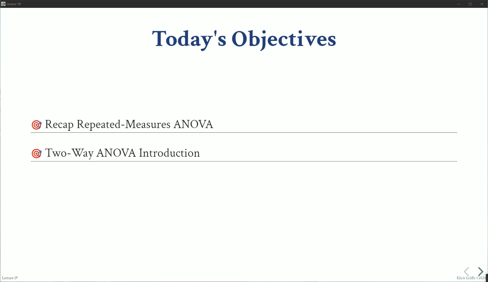
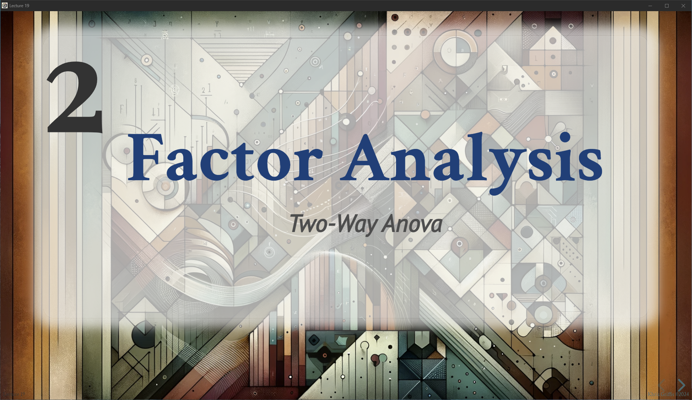

# Getting Started With RevealPack

The main purpose of this package is to make it easy to develop, package and share multiple Reveal.js presentations that share common resources and theming, e.g., a lecture series.

This guide will walk you through the process of creating and building a Reveal.js presentation using RevealPack. Follow these steps to get started with your presentation project.

## Installation

To begin, install RevealPack using pip. Ensure you are using Python 3.12 or a compatible version.

```bash
pip install revealpack
```

## Project Setup

1. **Create a Project Directory**:
    - Choose a directory for your project. Create a new directory if necessary.

```bash
mkdir my_presentation_project
cd my_presentation_project
```

2. **Initialize the Project**:
    - Initialize the RevealPack project in your chosen directory. This creates the necessary directory structure and configuration files.

```bash
revealpack init
```

    Alternatively, specify a different directory and navigate there:

```bash
revealpack init --destination /path/to/your/project
cd /path/to/your/project
```

3. **Update Configuration**:
    - Modify the generated `config.json` file to suit your project needs. Update the `info`, `directories`, `packages`, `theme`, `reveal_template`, `toc_template`, `logging`, `highlight_theme`, `custom_scripts`, `force_plugin_download`, and `reveal_configurations` fields.

```json
{
  "info": {
    "project_title": "My Reveal.js Lectures",
    "short_title": "revealLectures",
    "version": "1.0.0",
    "authors": ["Your Name"]
  },
  "directories": {
    "build": "dist",
    "source": {
      "root": "source",
      "presentation_root": "decks",
      "libraries": "lib"
    }
  },
  "packages": {
    "reveal.js": "5.1.0",
    "reveal_plugins": {
      "built_in": ["notes", "highlight", "math"],
      "external": {
        "vizzy": {
          "version": "1.0.4",
          "url": "https://github.com/Khlick/Vizzy/releases/download/v1.0.4/vizzy.js"
        }
      },
      "plugin_configurations": {
        "mathjax3": {
          "mathjax": "https://cdn.jsdelivr.net/npm/mathjax@4.0.0-beta.6/tex-mml-chtml.js",
          "loader": {
            "load": ["[tex]/html"]
          },
          "tex": {
            "packages": {
              "[+]": ["html"]
            },
            "inlineMath": [["$", "$"], ["\\(", "\\)"]]
          },
          "options": {
            "skipHtmlTags": ["script", "noscript", "style", "textarea", "pre"]
          }
        },
        "notes": {},
        "highlight": {},
        "vizzy": {
          "autoRunTransitions": true,
          "autoTransitionDelay": 100,
          "devMode": false,
          "onSlideChangedDelay": 0
        }
      }
    }
  },
  "theme": "custom_theme/theme.css",
  "reveal_template": "reveal_template.html",
  "toc_template": "toc_template.html",
  "logging": "detailed",
  "highlight_theme": "custom_theme/hybrid.css",
  "custom_scripts": [],
  "force_plugin_download": true,
  "reveal_configurations": {
    "controls": true,
    "progress": true,
    "slideNumber": true,
    "history": true,
    "center": true,
    "transition": "slide"
  }
}
```

4. **Setup the Project**:
    - Set up the environment for building presentations. This step downloads and installs Reveal.js packages, creates necessary directories, checks the theme, and generates templates.

```bash
  revealpack setup
```

___

## Creating Presentations

1. **Create Presentation Subdirectory**:
    - In the `source/decks` directory, create a subdirectory for each presentation.

1. **Add Presentation Files**:
    - Inside the presentation subdirectory, add HTML files for each slide. Include a `presentation.json` file for additional metadata and configuration.

    Example `presentation.json`:

```json
{
  "titlepage": {
    "headline": [
      "Analysis of Variance 3",
      "ANOVA Does Even More"
    ],
    "by": "Khris Griffis, Ph.D.",
    "byinfo": [
      "April 10, 2024",
      "CSULA: ME3040 Spring 2024"
    ],
    "background": {
      "image": "lib/img/power_1.png",
      "size": "cover"
    }
  },
  "footer": {
    "left": "Lecture 19",
    "right": "<a href=\"https:\\\\khrisgriffis.com\" target=\"_blank\" rel=\"noopener noreferrer\">Khris Griffis &#169;2024</a>"
  },
  "slides": [
    "objectives.html",
    "anova-repeated-measures-recap.html",
    "anova-two-way.html"
  ]
}
```

    When rendered, the final presentation will have the following title slide:

    
    *Figure 1. Example render of the presentation title. Note: This theming is provided by the custom_theme but your own may be different, see [theming](theme.md).*


    Example `objectives.html` (single slide):

    This slide only contains one section, so the section tags are not needed. The open and close tags are automatically handled by the template.

```html
---
---

<div class="grid-wrapper">
  <div class="header">
    <h2>Today's Objectives</h2>
  </div>
  <div class="content">
    <div class="grid-generic full-width left-justify big" style="grid-template-columns: 1fr; grid-auto-rows: auto; row-gap: 5vmin">
      <div class="border-bottom fragment" data-fragment-index="1">
        <p><i class="target"></i> Recap Repeated-Measures ANOVA</p>
      </div>
      <div class="border-bottom fragment" data-fragment-index="2">
        <p><i class="target"></i> Two-Way ANOVA Introduction</p>
      </div>
    </div>
  </div>
</div>
<aside class="notes">
  <p>Let's recap some of the concepts of ANOVA.</p>
</aside>
```
    This individual slide is rendered in the final presentation as: 

    
    *Figure 2. Example render of an individual slide. Note: This theming is provided by the custom_theme but your own may be different, see [theming](theme.md).*


    Example `anova-two-way.html` (multiple slides and section title):

    This slide contains a section title, followed by multiple slides. The section title needs a closing section tag, which allows us to style the section title content. 

```html
---
sectiontitle:
  headline:
    - "Factor Analysis"
    - "Two-Way ANOVA"
  image:
    url: "lib/img/multigroup_5.png"
---

<style>
  #section-content-2.section-title-content {
    background-color: rgba(240,240,240,0.7) !important;
    border-radius: 2rem !important;
    box-shadow: 0 0 2rem 2rem rgba(240,240,240,0.7) !important;
  }
</style>
</section>

<!-- Slide 1 -->
<section>
<!-- slide contents -->
</section>

<!-- Slide 2 -->
<section>
<!-- slide contents -->
</section>

<!-- Slide 3 (last slide, no closing section tag) -->
<section>
<!-- slide contents -->
```
    The section title in the `anova-two-way.html` file is the second section title in the presentation. We use CSS styles to create a light gray background for the overlay text, providing contrast against the background image.

    
    *Figure 3. Example render of section title yaml. Note: This theming is provided by the custom_theme but your own may be different, see [theming](theme.md).*

    ### Vertical Slide Stacks

    If you wish to insert a vertical slide stack (a column of slides), you can open and close the vertical slide stack sections in the slide. The YAML header must be empty for the vertical stack:

```html
---
---

<section>
<!-- Vertical Slide 1 -->
</section>

<section>
<!-- Vertical Slide 2 -->
</section>

<section>
<!-- Vertical Slide 3  -->
</section> <!-- Close last slide for vertical stacks -->
```
___

## Building Presentations

Once you have your assets in the libraries folders, and you have a deck or two to build, run the `revealpack build` command to generate the presentations and the table of contents:

```bash
revealpack build
```

After running the build command, the `dist` directory will contain the generated HTML files for each presentation and an `index.html` file as the table of contents.

## Serving Presentations Locally

To serve the presentations locally and watch for changes, run the `revealpack serve` command:

```bash
revealpack serve
```

This will start a live server and automatically rebuild the presentations when changes are detected in the decks and related directories.

## Packaging Presentations for Distribution

To package the presentations into a distributable format, use the `revealpack package` command:

```bash
revealpack package --build-dir path/to/new/export
```

For more details on each command, refer to the respective documentation pages:

- [Init](init.md)
- [Setup](setup.md)
- [Build](build.md)
- [Serve](serve.md)
- [Package](package.md)

For a complete list of configuration options, see the [Configuration](config.md) page.

## Developer Guide

For developers looking to contribute to RevealPack or customize it further, see the [Developer Guide](dev.md).

